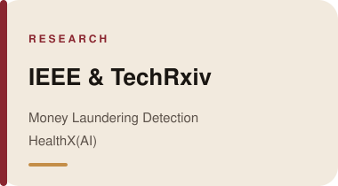

 

 

 

<table width="100%">
  <tr>
    <td width="33%" valign="top">
      
    </td>
    <td width="33%" valign="top">
      
    </td>
    <td width="33%" valign="top">
      
    </td>
  </tr>
</table>

<b>Read the papers</b>

 

<a href="https://doi.org/10.1109/ACROSET66531.2025.11280778">Money Laundering Detection — IEEE</a>
&nbsp;·&nbsp;
<a href="https://doi.org/10.36227/techrxiv.175329576.65152325/v1">HealthX(AI) — TechRxiv</a>

 

 

&nbsp;

&nbsp;

&nbsp;

