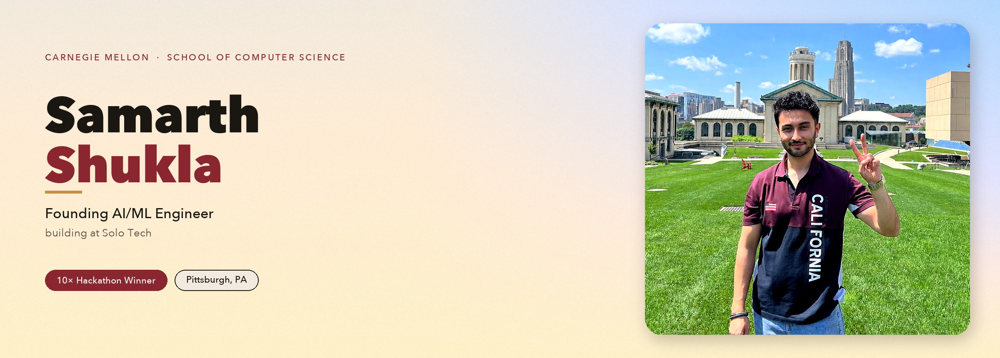
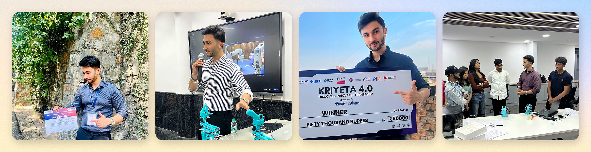

 

`AI Infrastructure`&nbsp;·&nbsp;`Full-Stack Systems`&nbsp;·&nbsp;`LLM / VLM`&nbsp;·&nbsp;`Edge AI`&nbsp;·&nbsp;`Physical AI`&nbsp;·&nbsp;`Robotics`&nbsp;·&nbsp;`Dev Tooling`

 

**10× Hackathon Winner**  
9 national · 1 international · 2,000+ in the field

 

**Published research**

&nbsp;

 

**Now** — research to production at [Solo Tech](https://getsolo.tech/) · open source [Solo CLI](https://github.com/GetSoloTech/solo-cli)

 

&nbsp;

&nbsp;

&nbsp;

 

