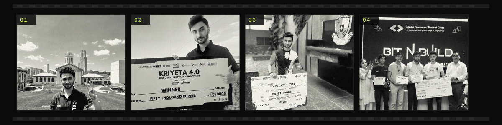

 

`AI INFRASTRUCTURE` · `FULL-STACK SYSTEMS` · `LLM / VLM` · `EDGE AI` · `PHYSICAL AI` · `ROBOTICS` · `DEV TOOLING`

 

**[ 002 / RECORD ]**
🏆 10× Hackathon Winner — 9 National · 1 International · 2,000+ participants
📚 IEEE & TechRxiv — [Money Laundering Detection](https://doi.org/10.1109/ACROSET66531.2025.11280778) · [HealthX(AI)](https://doi.org/10.36227/techrxiv.175329576.65152325/v1)

**[ 003 / BUILDING ]**
Research → production, at **[Solo Tech](https://getsolo.tech/)** · open-source: **[Solo CLI](https://github.com/GetSoloTech/solo-cli)**

 

[`LinkedIn`](https://www.linkedin.com/in/samarthshuklacmu) &nbsp;·&nbsp; [`Resume`](https://docs.google.com/document/d/1ZBS85Y52l5arwUwD2i-pHaReOGmp8wI58LFkM5EtHxg/edit?usp=drive_link) &nbsp;·&nbsp; [`Solo Tech`](https://getsolo.tech/) &nbsp;·&nbsp; [`Solo CLI`](https://github.com/GetSoloTech/solo-cli)

 

